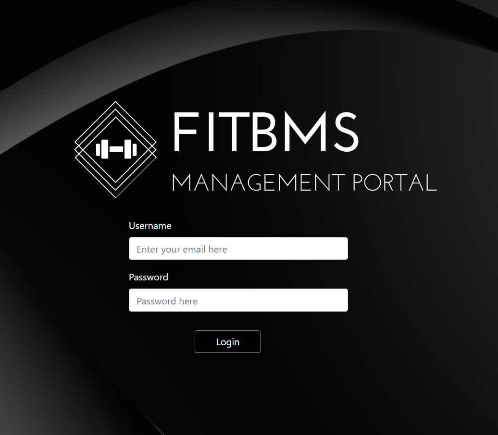

# bms

Rutgers Coding Bootcamp Project 3 - [Deployed on Heroku](https://fitbms.herokuapp.com/)

FitBMS is a business management software for gyms. It is a full-featured CRUD software consisting of three different mini-applications. 

## Getting Started

FitBMS can be used to:

  * `check in to the gym`

  * `create member profile`

  * `members can add classes through the member portal`

  * `management can see who has checked in, see existing trainers, delete members, add/edit/delete classes, and assign trainers to a class`

### How FitBMS Works

## Application 1: Check In

1. Before being able to check in, management must sign in for authentication.

    

2. On the Log In page, users can search for their name and indicate whether they are trainers or there for a class as a member.

    

## Application 2: Member Portal

1. Members must log in for authentication.

    

2. Once on the dashboard, users can see their profile and sign up for classes.

    **Profile**

    

    **Classes**

    

## Application 3: Management Portal

1. Once signed in, management can check attendance, trainers, and classes.

  **Dashboard**

    

  **Members**

    

  **Classes**

    

## Created By

* **Amiel Nicdao** 
* **Deion Aujero**
* **Christian Reyes**
* **Claudia Gutarra**

## Technologies

* React
* JavaScript
* Dependencies:
    * Express
    * mySQL
    * Axios
* Firebase
* Reactstrap

## Future Development

* Payment system
* Management notifications to members
* Calendar of Classes
* Employee Management

## Acknowledgments

* Instructor
* TAs
* Groupmates